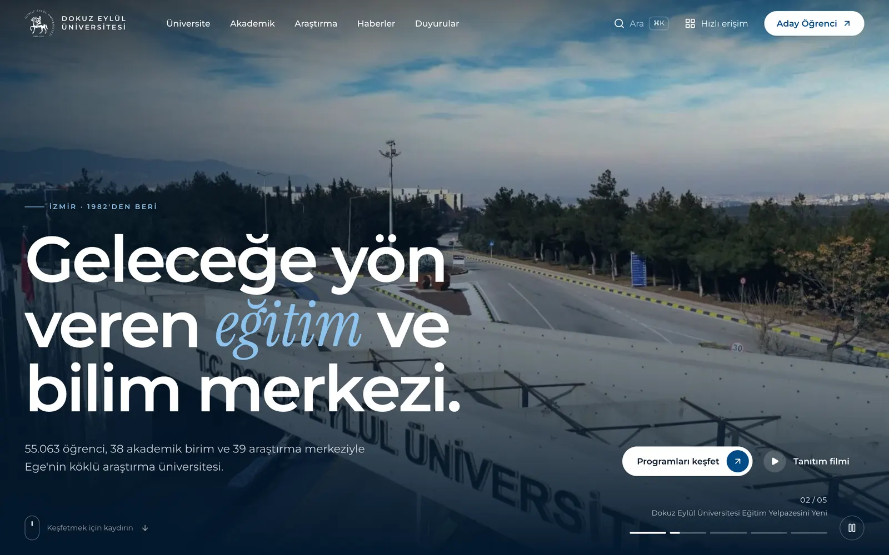
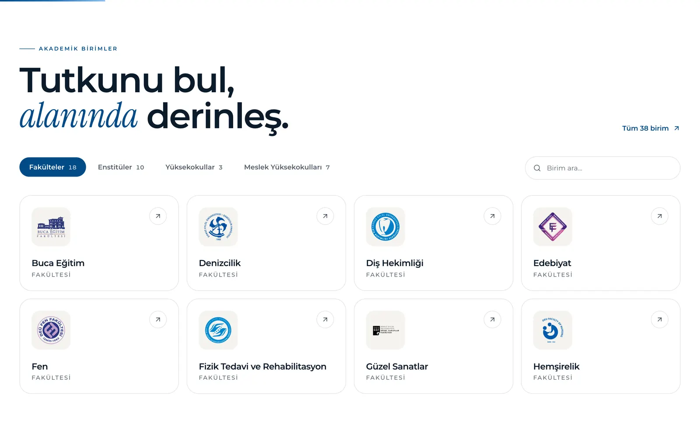
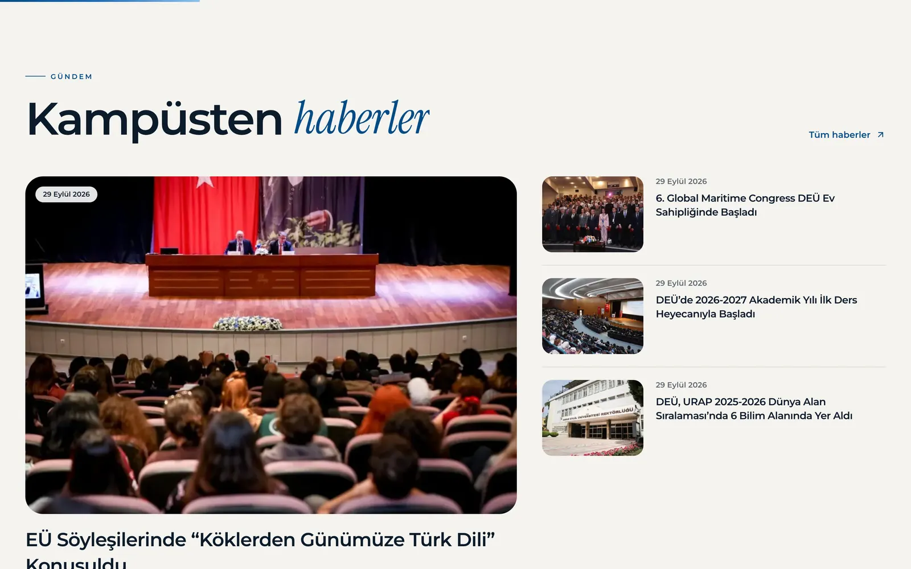
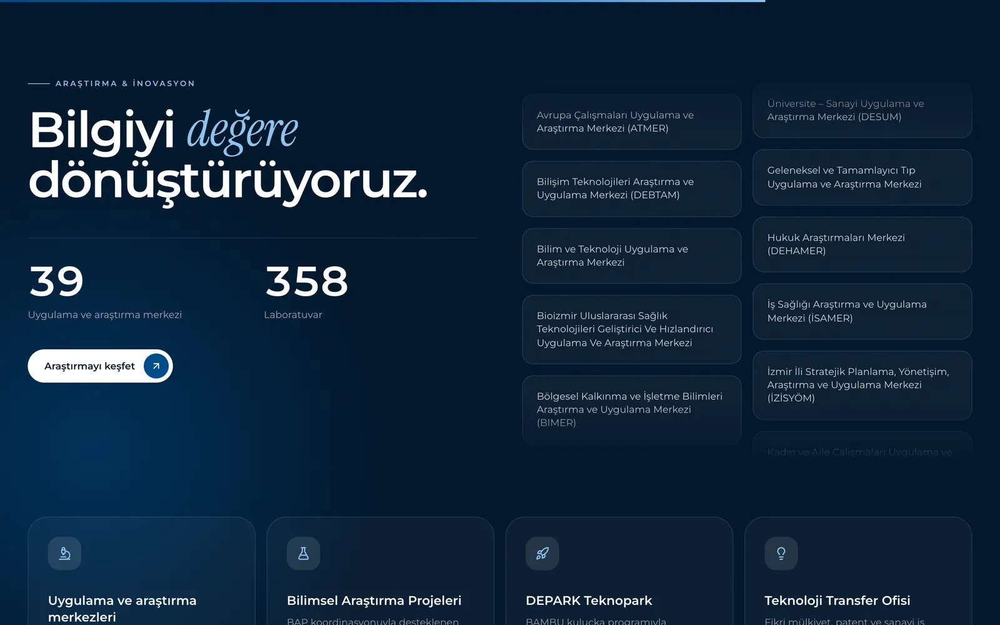
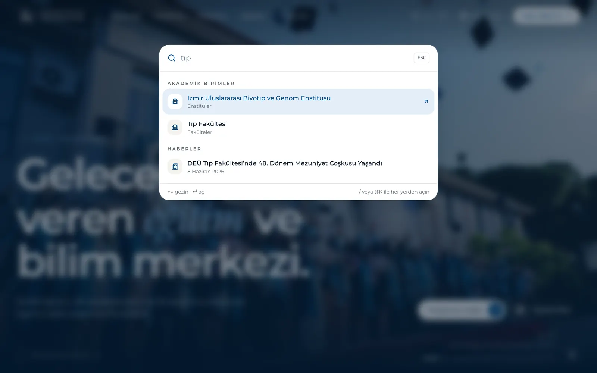
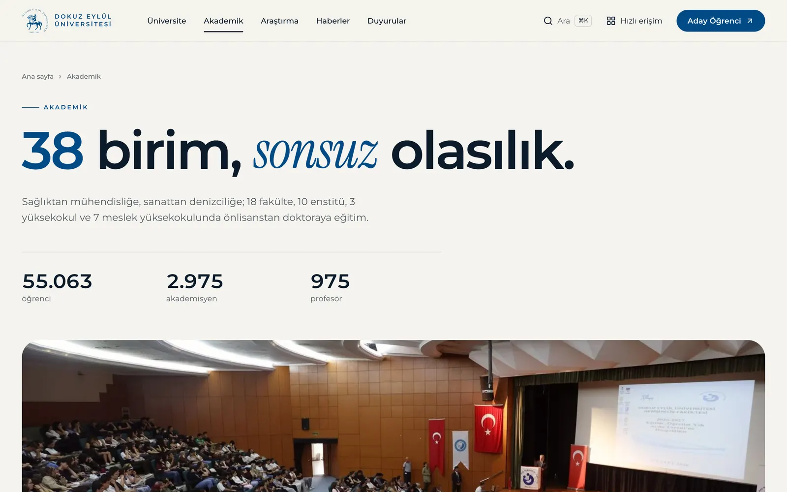
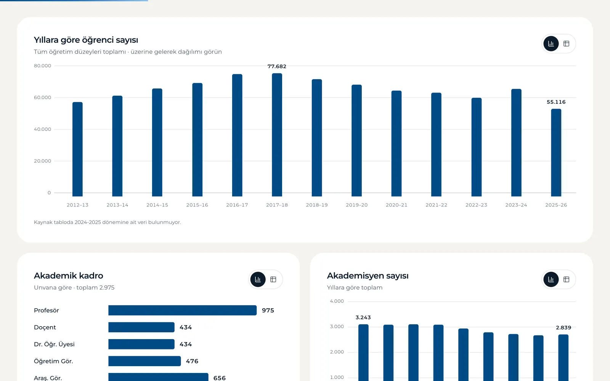
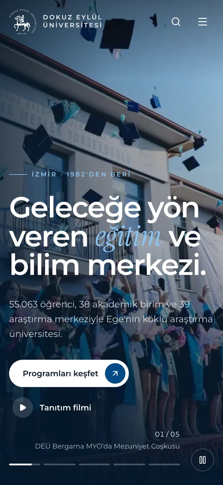
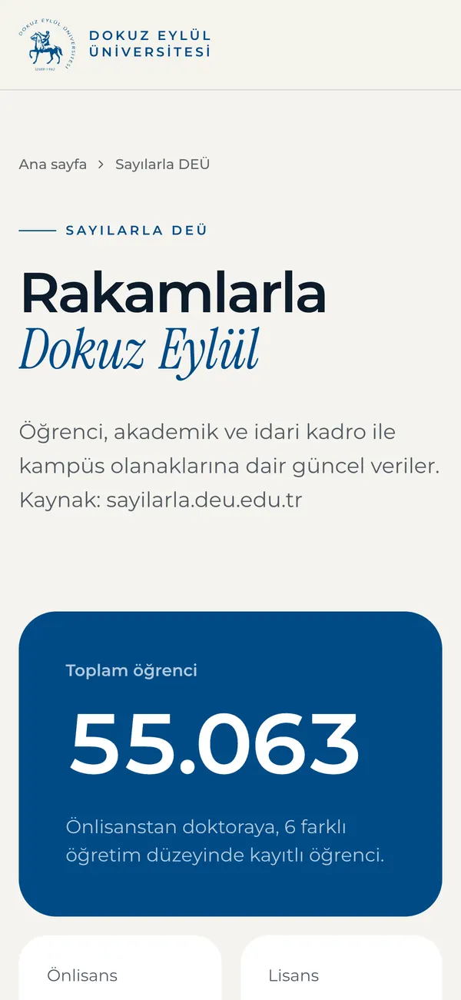
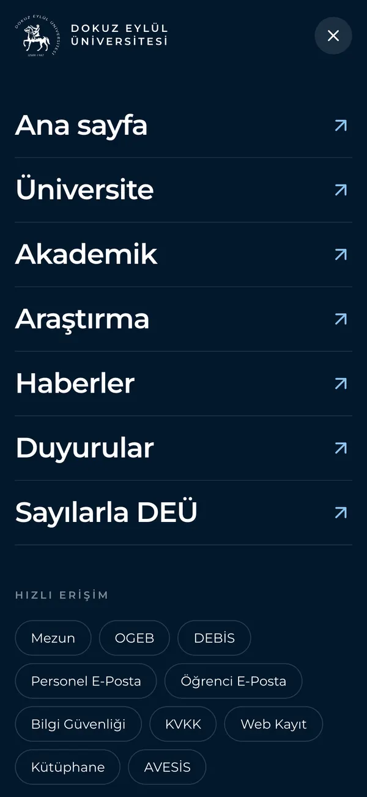

<div align="center">

# DEÜ Web — yeniden tasarım konsepti

**Dokuz Eylül Üniversitesi için gerçek içeriğiyle kurulmuş; görsel ağırlıklı, etkileşimli ve modern bir web sitesi konsepti.**

[**Canlı demo → deu.salivra.com**](https://deu.salivra.com) · [English](README.md) · [Mimari (EN)](docs/ARCHITECTURE.md)



</div>

> [!NOTE]
> Bu **bağımsız ve resmî olmayan** bir tasarım çalışmasıdır; Dokuz Eylül Üniversitesi ile bir bağı yoktur. İçerik, fotoğraflar ve logolar üniversiteye aittir; ayrıntılar en alttaki “İçerik ve marka hakları” bölümünde.

## Neden

Üniversite siteleri zamanla link listelerine dönüşüyor. Bu proje şu soruyu soruyor: DEÜ'nün sitesi bugün tasarlansaydı nasıl hissettirirdi? Fotoğraf önde, aday öğrenci için net yollar, hızlı arama ve süslemek yerine yön gösteren animasyonlar. Sitedeki her metin, sayı ve fotoğraf gerçek; DEÜ'nün herkese açık sitelerinden çekildi. Böylece tasarım lorem ipsum ile değil, gerçek içerikle sınandı.

## Öne çıkanlar

- **Gerçek içerik, statik build.** 60 haber, 19 duyuru, 38 akademik birim, 39 araştırma merkezi ve 341 kampüs fotoğrafı build sırasında Markdown/JSON arşivinden okunuyor; 92 sayfa önceden üretiliyor.
- **Her yerden ⌘K arama.** Sayfalar, birimler, haberler ve duyurular tek bir komut paletinde. Türkçe karakterler katlanıyor; `ogrenci` yazınca *öğrenci* bulunuyor.
- **Amaca hizmet eden animasyon.** Kelime kelime açılan başlıklar, Ken Burns efektli otomatik hero, sabitlenip yana akan "kampüste hayat" galerisi, mıknatıslı butonlar, sayaçlar, sayfa geçişleri. Hepsi `prefers-reduced-motion` ayarına uyuyor.
- **Okunabilir veri.** *Sayılarla DEÜ* sayfası resmî istatistikleri erişilebilir grafiklere çeviriyor; her grafikte ipucu ve tablo görünümü var.
- **Kurumsal kimliğe sadık.** Renk, tipografi ve logo kullanımı DEÜ Kurumsal Kimlik Kılavuzu'na göre (Pantone 301 C, Montserrat; amblem döndürülmüyor ve yeniden renklendirilmiyor).
- **Telefonda hızlı.** Lighthouse mobil: Performans 97–98, Erişilebilirlik 97, En İyi Uygulamalar 100, SEO 100 ([nasıl](docs/ARCHITECTURE.md#performance)).

## Ekran görüntüleri

| | |
| --- | --- |
|  |  |
| Filtrelenebilir, aranabilir akademik birimler | Haber vitrini |
|  |  |
| Araştırma ve inovasyon | Site genelinde ⌘K arama |
|  |  |
| Akademik genel bakış | Erişilebilir grafiklerle istatistikler |

<p align="center">
  
  
  
</p>

## Teknolojiler

| | |
| --- | --- |
| Framework | Next.js 16 App Router (Cache Components, Partial Prerendering), React 19 |
| Stil | Tailwind CSS 4; marka token'ları `@theme` içinde |
| Animasyon | Motion; ekranın üst kısmındaki girişler için CSS keyframes; masaüstünde yumuşak kaydırma için Lenis |
| Arama | cmdk |
| İçerik | [`content/`](content/) altında Markdown ve JSON; `react-markdown` + `remark-gfm` |
| Görseller | `next/image`; boyutlar ve blur önizlemeler build sırasında sharp ile üretiliyor |
| Fontlar | Montserrat ve Instrument Serif; self-host, önyüklemeli, ölçüleri eşlenmiş yedek fontlarla |
| Scraper | Python 3.11+ (uv ile çalışır) |
| Yayın | Netlify (OpenNext adapter) |

## Kurulum

Gerekenler: **Node.js 22** ([`.nvmrc`](.nvmrc)) ve **pnpm 10** (`corepack enable` sabitlenmiş sürümü kullanır).

```bash
git clone https://github.com/rivalth/deu-web-remake.git
cd deu-web-remake
pnpm install
pnpm dev
```

<http://localhost:3000> adresini açın. İçerik arşivi repoda olduğu için siteyi çalıştırmak için scraping gerekmez.

| Komut | Ne yapar |
| --- | --- |
| `pnpm dev` | Medyayı senkronlar, geliştirme sunucusunu başlatır |
| `pnpm build` | Medyayı senkronlar, production build alır |
| `pnpm start` | Production build'i sunar |
| `pnpm media` | Görselleri, birim logolarını ve fontları `public/` altına kopyalar; `src/generated/media.json` dosyasını üretir |
| `pnpm lint` | ESLint |
| `pnpm typecheck` | Route tiplerini üretir, TypeScript kontrolü yapar |

İçeriği DEÜ sitelerinden yenilemek için (isteğe bağlı, [uv](https://docs.astral.sh/uv/) gerekir):

```bash
uv run scripts/scrape_deu.py                 # hepsi
uv run scripts/scrape_deu.py --only news     # ya da: home, pages, news, announcements, stats
```

Klasör yapısı, içerik hattı, animasyon sistemi ve performans kararları [docs/ARCHITECTURE.md](docs/ARCHITECTURE.md) dosyasında anlatılıyor.

## Katkı

Fikirler, hata bildirimleri ve pull request'ler memnuniyetle karşılanır. Önce [CONTRIBUTING.md](CONTRIBUTING.md) dosyasına göz atın.

## İçerik ve marka hakları

**Kaynak kod** [MIT Lisansı](LICENSE) ile yayınlanmıştır.

[`content/`](content/) ve [`brand/`](brand/) altındaki her şey (metinler, fotoğraflar, logolar, amblem ve kurumsal kimlik kılavuzu) **Dokuz Eylül Üniversitesi**'ne aittir. Üniversitenin herkese açık sitelerinden derlenmiş olup yalnızca bu tasarım çalışmasını göstermek için repoda yer alır ve MIT Lisansı kapsamında **değildir**. Bkz. [NOTICE.md](NOTICE.md).
